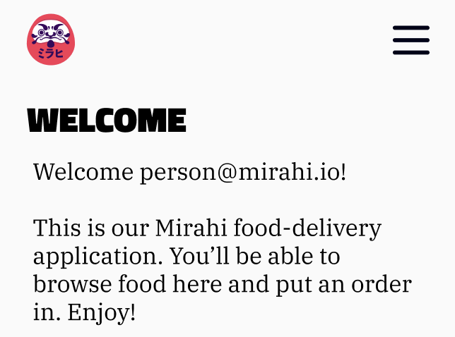

# Exercise 3 - Challenges

Here's a few challenge with our new drawer !

1. Implement logout in drawer
2. When coming back from profile screen, change the default behaviour of the drawer navigator by opening the drawer
   instead of having it be closed
3. You might see some issues with spacing and/or colors in the drawer, implement SafeAreaView and StatusBar to avoid
   having the drawer content blocked by the hardware notches and/or status bar colors that do not match the drawer
   background
4. Add a custom header based on this design:

5. Make the drawer open from right to left and take the full width of the screen.
